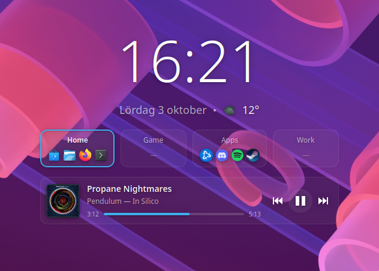

# DeskClock

A clean, background-free KDE Plasma 6 desktop widget: a large clock with the
date and current outdoor temperature, an overview of your virtual desktops
showing which apps are open on each, and the currently playing media.



- Optional frosted-glass tiles/cards: the wallpaper behind them is blurred (Off / Frosted / Frosted vivid, with a strength slider)
- Large clock (12/24 h, optional seconds) and localized date
- Current outdoor temperature and conditions from [Open-Meteo](https://open-meteo.com) (free, no account or API key)
- One card per virtual desktop with the icons of the apps on it; click to switch
- Now playing: album art, title, artist and album, a seekable progress bar and
  previous / play-pause / next controls for Spotify, browsers or any MPRIS player
- Hover tooltips:
  - **Clock:** full date, week number, day of year, UTC offset, sunrise/sunset
  - **Weather:** conditions, feels-like, high/low, humidity, wind, chance of rain, sunrise/sunset
  - **Desktop cards:** the titles of the windows open on that desktop
  - **Now playing:** track, artist, album and which app is playing
- Soft drop shadow so it stays readable on any wallpaper
- Follows your Plasma color scheme

## Settings

Right-click the widget → **Configure DeskClock…**

- **Clock:** 24-hour time, seconds, date
- **Weather:** search for your location (results show region, country and
  coordinates so same-named places can be told apart), show the city name, °C/°F
- **Virtual desktops:** names or numbers, include apps pinned to all desktops,
  max icons per desktop, icon size
- **Now playing:** show/hide, album art, progress bar, hide when paused
- **Appearance:** size, text color, drop shadow, desktop card tint, and
  automatic horizontal/vertical centering

## Privacy

The location search sends what you type to Open-Meteo's geocoding API. Weather
updates send only the chosen coordinates to Open-Meteo, at most every 10
minutes. Your location is stored only in your local Plasma configuration.

## Requirements

- KDE Plasma 6
- Python 3 (standard library only)

## Install

The folder name must match the plugin id:

```sh
git clone https://github.com/zhelly0/deskclock ~/.local/share/plasma/plasmoids/com.github.zhelly0.deskclock
```

Then right-click the desktop → **Add Widgets…** → search for **DeskClock**. If it
doesn't show up, restart Plasma: `systemctl --user restart plasma-plasmashell`.

To update: `git pull` in that folder and restart Plasma.

## License

GPL-3.0, see [LICENSE](LICENSE).
